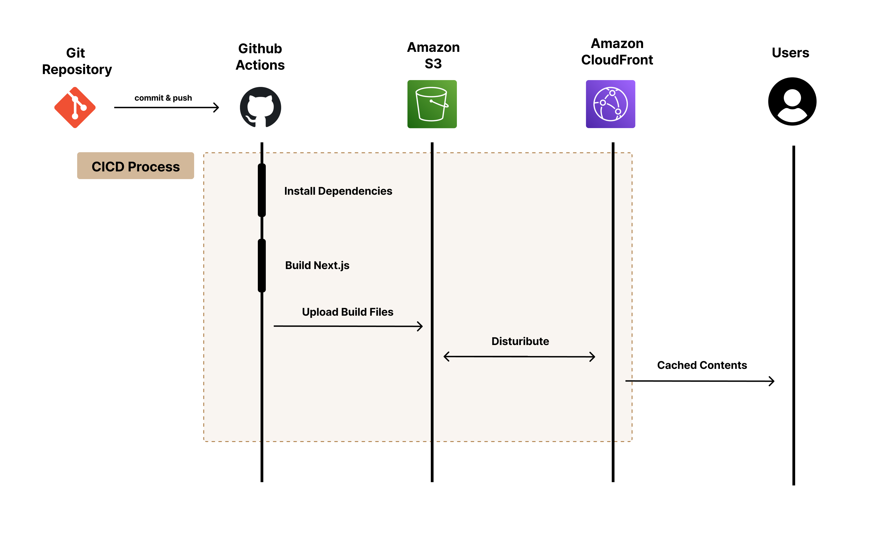
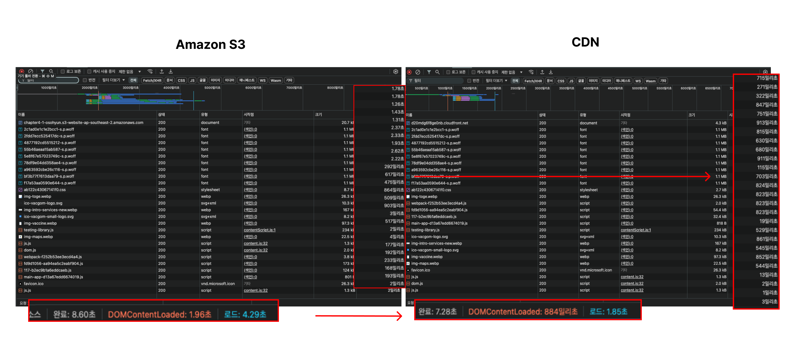
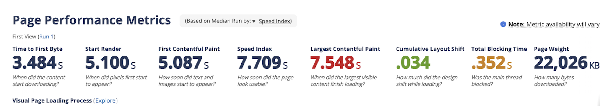
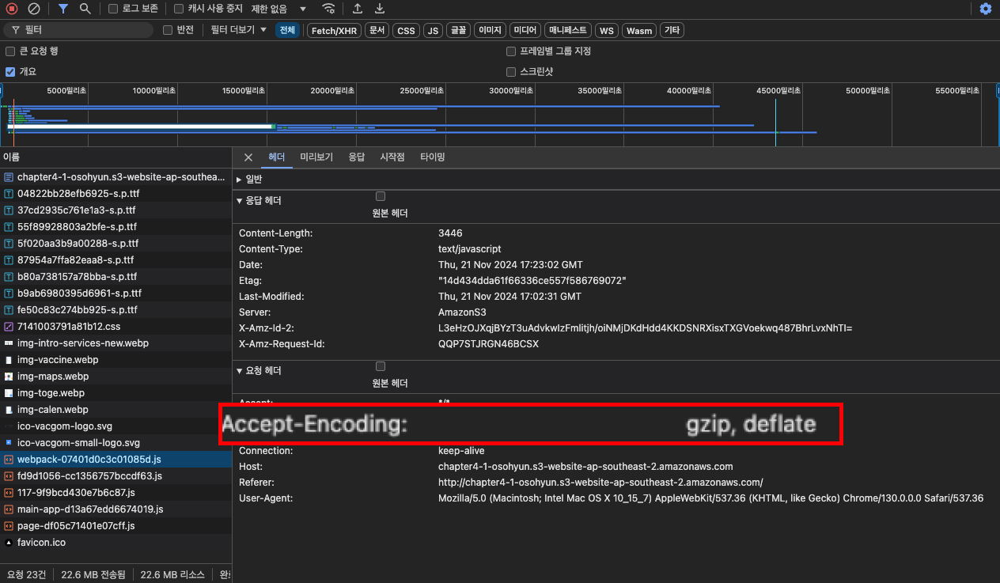
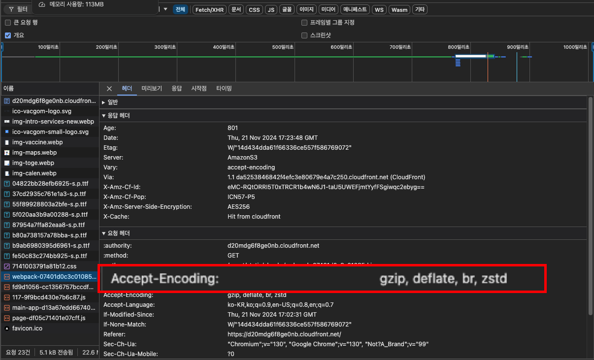
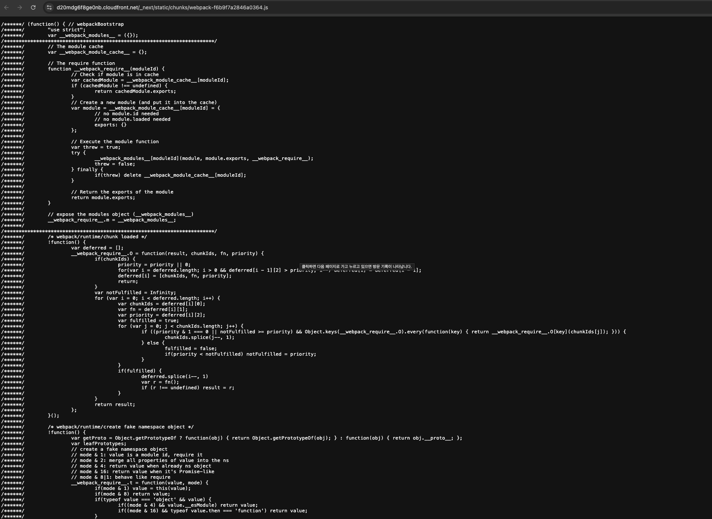
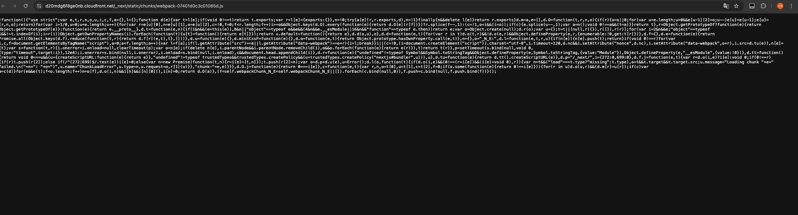
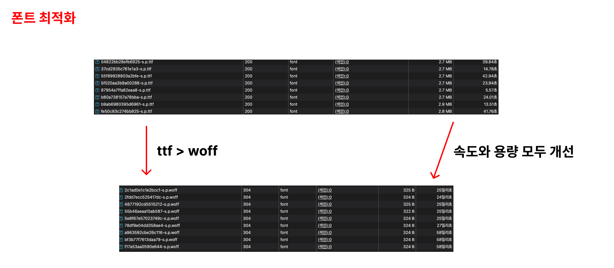
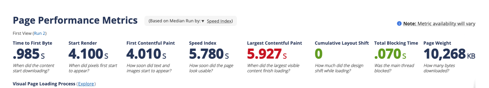
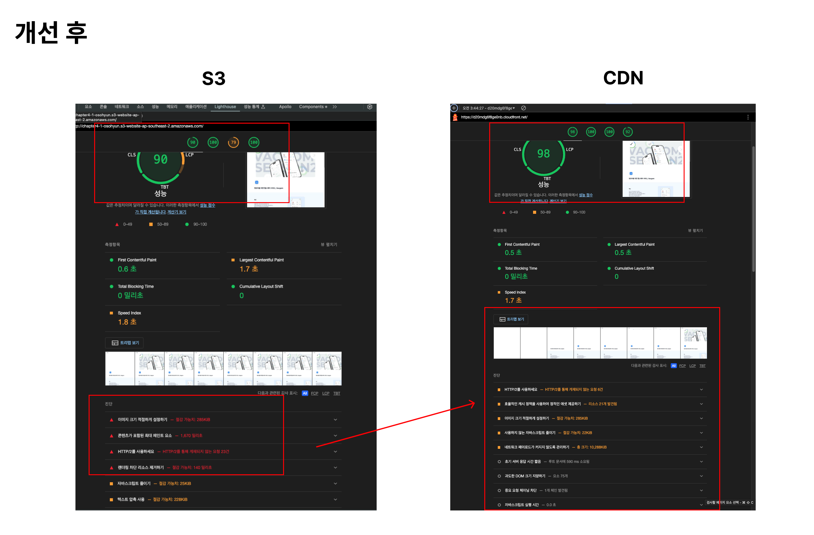

# 항해 플러스 프론트엔드 9주차 과제 

## 목차

  - [1. 과제 개요](#️-1-과제-개요)
  - [2. 배포 프로세스 구조](#-2-배포-프로세스-구조)
  - [2. 주요 링크](#-2-주요-링크)
  - [3. 주요 개념 정리](#-3-주요-개념-정리)
    - [(1) GitHub Actions과 CI/CD 도구](#1-github-actions과-cicd-도구)
    - [(2) S3와 정적 웹 호스팅](#2-s3와-정적-웹-호스팅)
    - [(3) CloudFront와 CDN](#3-cloudfront와-cdn)
    - [(4) 캐시 무효화(Cache Invalidation)](#4-캐시-무효화cache-invalidation)
    - [(5) Repository Secret과 환경 변수](#5-repository-secret과-환경-변수)
  - [4. 배포 프로세스 정리](#-4-배포-프로세스-정리)
    - [GitHub Actions 워크플로우](#github-actions-워크플로우)
  - [5. S3 → CloudFront 성능 최적화 분석 보고서](#-5-s3--cloudfront-성능-최적화-분석-보고서)
    - [(1)테스트 환경](#-1-테스트-환경)
    - [(2)테스트 결과](#-2테스트-결과)
    - [(3)CDN 사용 후 성능 개선](#-3cdn-사용-후-성능-개선)
  - [6. 프로젝트 자체 성능 개선 과정](#-6-프로젝트-자체성능-개선-과정)
    - [(1) 성능 개선 미션 소개](#-1-성능-개선-미션-소개)
    - [(2) 성능 개선의 필요성](#2-성능-개선의-필요성)
    - [(3) 개선 전 원본 홈페이지의 성능](#-3-개선-전-원본-홈페이지의-성능)
      - [1) S3로 배포한 사이트의 성능](#1-s3로-배포한-사이트의-성능)
      - [2) CloudFront로 배포한 사이트의 성능](#2-cloudfront로-배포한-사이트의-성능)
    - [(4) 본격적으로 성능 개선 과정](#-4-본격적으로-성능-개선-과정)
      - [1) 요청 크기를 줄여보자!](#1-요청-크기를-줄여보자)
      - [2) 폰트 최적화](#2-폰트-최적화)
      - [3) 이미지 최적화](#3-이미지-최적화)
    - [(5) 개선 후 성능](#-5-개선-후-성능)
    - [(6) 개선 전 후 성능 비교](#️-6-개선-전-후-성능-비교)
    - [(7) 성능 개선 결과](#--7-성능-개선-결과)
    - [(8) Lighthouse 결과 비교](#-8-lighthouse-결과-비교)
    - [(9) 라이트 하우스 결과 정리](#-9-라이트-하우스-결과-정리)
      
## 💁🏻‍♀️ 1. 과제 개요

이번 과제는 AWS S3와 CloudFront를 활용하여 Next.js 애플리케이션의 정적 파일을 효율적으로 호스팅하고, GitHub Actions를 통해 자동화된 배포 파이프라인을 구축하였습니다.

웹 애플리케이션의 성능 최적화와 배포 자동화에 대한 실질적인 경험을 제공하며, AWS와 GitHub Actions의 활용 능력을 향상시키는 것을 목표로 이번 주차 과제를 진행하였습니다.


## 📸 2. 배포 프로세스 구조



## 🔗 2. 주요 링크 
- S3 단독 사용: http://chapter4-1-osohyun.s3-website-ap-southeast-2.amazonaws.com
- CloudFront CDN 배포 : https://d20mdg6f8ge0nb.cloudfront.net/
  

## 📚 3. 주요 개념 정리

### (1) GitHub Actions과 CI/CD 도구
- GitHub Actions는 GitHub에서 제공하는 CI/CD(Continuous Integration/Continuous Deployment) 플랫폼으로, 소프트웨어 개발 워크플로우를 자동화하는 도구입니다. 이를 통해 코드 변경사항이 발생할 때마다 자동으로 린트, 빌드, 테스트, 배포 과정을 실행할 수 있습니다.
- CI/CD는 지속적 통합(Continuous Integration)과 지속적 배포(Continuous Deployment)를 의미합니다. CI는 코드 변경 시 자동으로 빌드와 테스트를 수행하여 코드의 품질을 유지하고, CD는 코드가 성공적으로 빌드되면 자동으로 배포하여 최신 상태를 유지합니다.
- 코드가 main 브랜치에 푸시되거나 PR(Pull Request)이 생성될 때 자동으로 빌드, 테스트, 배포를 수행합니다.
- .github/workflows 디렉토리에 YAML 형식으로 워크플로우를 정의하여, 다양한 이벤트에 대한 자동화 작업을 설정할 수 있습니다.
- GitHub Actions에서 필요한 민감한 정보를 안전하게 관리할 수 있습니다.
- 수동 배포 과정을 없애고, 배포 과정의 일관성과 신뢰성을 확보하며, 개발자가 수동 작업 없이 안정적인 배포를 수행할 수 있습니다.

### (2) S3와 정적 웹 호스팅
- Amazon S3(Simple Storage Service)는 AWS의 확장 가능한 객체 스토리지 서비스로, 정적 웹사이트 호스팅 기능을 제공합니다. 높은 내구성과 가용성을 제공하며, 다양한 파일 형식을 저장하고 서비스할 수 있습니다.
- 웹 서버 없이도 정적 파일을 호스팅할 수 있습니다. Next.js로 빌드된 정적 파일들을 S3에 저장하여 서비스합니다.
- 대량의 데이터를 저장하고 관리할 수 있는 확장성을 제공하며, 사용한 만큼만 비용을 지불하는 구조로, 초기 비용 없이 시작할 수 있습니다.
- 빌드된 파일을 S3에 동기화하여 최신 상태를 유지합니다.

### (3) CloudFront와 CDN
- Amazon CloudFront는 AWS의 CDN(Content Delivery Network) 서비스로, 전 세계에 분산된 엣지 로케이션을 통해 콘텐츠를 캐싱하고 사용자와 가까운 위치에서 콘텐츠를 제공함으로써 지연 시간을 최소화하고 성능을 향상시킵니다.
- S3에 저장된 파일을 전 세계 엣지 로케이션에 캐싱하여 빠르게 전송하는 콘텐츠 캐싱 기능을 제공합니다. 보안 연결을 통해 데이터를 안전하게 전송할 수 있고, 사용자와 가까운 위치에서 콘텐츠를 제공하여 로딩 시간을 단축합니다.
- 배포 후 CloudFront 캐시를 무효화하여 최신 콘텐츠를 제공합니다.

### (4) 캐시 무효화(Cache Invalidation)
- CloudFront의 엣지 로케이션에 캐싱된 콘텐츠를 강제로 새로고침하여, 사용자가 항상 최신 버전의 콘텐츠를 받을 수 있도록 보장하는 과정입니다.
- 새로운 배포 시 이전 캐시된 콘텐츠를 무효화하여 최신 콘텐츠를 제공합니다.
- GitHub Actions의 deployment.yml 워크플로우에서 create-invalidation 명령어를 통해 자동으로 수행됩니다.

### (5) Repository Secret과 환경 변수
- Repository Secret은 GitHub 저장소에서 민감한 정보를 안전하게 관리하기 위한 기능입니다. 환경 변수와 유사하게 동작하지만, 외부에 노출되지 않도록 보호됩니다.
- AWS 인증 정보와 같은 민감한 정보를 안전하게 저장하고 관리합니다.
- 워크플로우 실행 시 필요한 값들을 환경 변수로 주입하여 사용합니다.
- 민감한 정보를 안전하게 보호하여 보안 사고를 예방합니다.


## 👷 4. 배포 프로세스 정리

### GitHub Actions 워크플로우
자동화된 배포는 다음과 같이 진행됩니다:)

#### #1 소스 코드 체크아웃
GitHub repository의 코드를 Actions runner로 가져옵니다.

```yml
   - name: Checkout repository
     uses: actions/checkout@v4
```

#### #2 Node.js 환경 설정
Node.js 20 버전을 설정하여 최신 환경에서 빌드를 진행합니다.

```yml
   - name: Use Node.js 20
     uses: actions/setup-node@v4
     with:
       node-version: "20"
```

#### #3 의존성 캐싱 및 설치
- `actions/cache`를 사용하여 `node_modules`를 캐싱합니다.
- 캐시가 없을 경우 `npm ci` 명령어로 프로젝트 의존성을 설치합니다.

```yml
   - name: Cache node_modules
     id: cache-node-modules
     uses: actions/cache@v4
     with:
       path: "**/node_modules"
       key: ${{ runner.os }}-node-${{ hashFiles('package-lock.json') }}
       restore-keys: |
         ${{ runner.os }}-node-

   - name: Install dependencies if cache is missing
     if: steps.cache-node-modules.outputs.cache-hit != 'true'
     run: npm ci
```

#### #4 코드 린트
- `npm run lint` 명령어로 코드 스타일을 검사합니다.

```yml
   - name: Lint
     run: npm run lint
```

#### #5 Next.js 프로젝트 빌드
- `npm run build` 명령어로 프로덕션 최적화된 빌드를 생성합니다.

```yml
   - name: Build
     run: npm run build
```

#### #6 AWS 자격 증명 구성
- GitHub Secrets에 저장된 AWS 인증 정보를 사용하여 안전하게 AWS 리소스에 접근합니다.

```yml
   - name: Configure AWS credentials
     uses: aws-actions/configure-aws-credentials@v1
     with:
       aws-access-key-id: ${{ secrets.AWS_ACCESS_KEY_ID }}
       aws-secret-access-key: ${{ secrets.AWS_SECRET_ACCESS_KEY }}
```

#### #7 S3 버킷 배포

- 빌드된 정적 파일을 S3 버킷에 업로드합니다.
- `aws s3 sync` 명령어로 변경된 파일만 효율적으로 업로드합니다.

```yml
   - name: Deploy to S3
     run: aws s3 sync build/ s3://${{ secrets.AWS_BUCKET_NAME }} --delete
```

#### #8 CloudFront 캐시 무효화
- `aws cloudfront create-invalidation` 명령어로 CloudFront 캐시를 무효화합니다.

```yml
   - name: Invalidate CloudFront cache
     run: aws cloudfront create-invalidation --distribution-id ${{ secrets.CLOUDFRONT_DISTRIBUTION_ID }} --paths "/*"
```


## 📊 5. S3 → CloudFront 성능 최적화 분석 보고서

### 📌 (1) 테스트 환경
- S3 단독 사용: http://chapter4-1-osohyun.s3-website-ap-southeast-2.amazonaws.com
- CloudFront CDN 배포 : https://d20mdg6f8ge0nb.cloudfront.net/
  
### 📝 (2)테스트 결과




| 측정 지표               | S3 단독 |  CDN | 개선율     |
|-------------------------|--------------|----------------|------------|
| **총 완료 시간**        | 8.6s    | 7.28s| 15.3% ⬇️     |
| **DOMContentLoaded**    | 1.96s   | 884ms| 54.9% ⬇️     |
| **로드**                | 4.29s   | 1.85s| 56.9% ⬇️     |
| **전송 크기**           | 11.0MB  | 10.8MB| 1.8% ⬇️      |
| **리소스 크기**         | 11.0MB  | 11.0MB | 0%       |


### 🔍 (3)CDN 사용 후 성능 개선

✅ **총 완료 시간** 

CloudFront를 사용하여 총 완료 시간이 15.3% 감소하는 결과가 나왔습니다! 이는 CDN이 콘텐츠를 더 빠르게 전달하여 전체 로딩 시간을 줄였기 때문에 성능이 개선되었습니다 :)
  
✅ **DOMContentLoaded**

DOMContentLoaded 시간이 54.9% 감소하여, 초기 페이지 렌더링이 훨씬 빨라졌습니다. 이는 CDN의 캐싱 효과 덕분입니다 :)

✅ **로드**

전체 로드 시간이 56.9% 감소했습니다. CloudFront는 콘텐츠를 엣지 서버에 캐싱하여, 사용자에게 더 빠르게 제공할 수 있습니다 :)

✅ **전송 크기**

전송 크기가 1.8% 감소했습니다. CloudFront는 Gzip 또는 Brotli 압축을 사용하여 파일 크기를 줄이고, 전송 속도를 향상시킵니다.

✅ **리소스 크기**

리소스 크기는 동일하지만, CDN의 효율적인 전송 방식 덕분에 전반적인 성능이 개선되었습니다.


## 🚀 6. 프로젝트 자체성능 개선 과정 

### 📕 (1) 성능 개선 미션 소개
몇 달 전, 급하게 사이드 프로젝트 Vacgom의 공식 홈페이지를 개발하게 되었었고 전혀 성능을 고려하지 않고 급하게 배포해 출시했습니다.

앞선 경험을 반성하며 이번 주차 과제의 대상이 되는 프로젝트를 해당 홈페이지 일부 코드를 가져와 추가로 성능 개선을 함께 진행해보았습니다.

제가 이번 성능 개선 미션에서 사용한 도구는 `CloudFront`, `Chrome DevTools > Network`, `WebPageTest` 입니다.

### 🔥 (2) 성능 개선의 필요성

왜 성능 개선을 해야할지? 그리고 언제 성능 개선을 해야할지 평소에 궁금했습니다.

원래 처음에 배포하고 나서는 딱히 제가 만든 웹사이트에 불편함을 느낄 수 없을 수 있다. 하지만 회사에서는 **개선이 반드시 필요한 서비스**를 만나서 내가 스스로 개선해야하기 때문입니다!

이러한 상황을 만났을 때 문제를 스스로 정의하고 잘 해쳐나가기 위해 성능을 어떻게 개선시킬 수 있고 어떠한 방식으로 성능을 개선해나가는지 배울 수 있을 것이라고 생각했고 이 성능 개선 작업을 진행하게 되었습니다.

### ✅ (3) 개선 전 원본 홈페이지의 성능

원본 홈페이지의 성능을 [WebPageTest](https://www.webpagetest.org/)를 통해 측정해보았습니다.

#### 1) S3로 배포한 사이트의 성능




#### 2) CloudFront로 배포한 사이트의 성능


CDN을 통해 배포한 사이트의 성능이 S3로 배포한 사이트의 성능보다 더 빠르게 측정되었지만 아직 개선이 필요한 부분이 있습니다.

## 💫 (4) 본격적으로 성능 개선 과정

### 1) 요청 크기를 줄여보자!

#### 1.1) 압축 설정

webpack과 AWS CloudFront 도구를 통해 요청 크기를 줄여보고자 노력했습니다.

먼저, 압축에 관한 내용인데요! S3는 기본적으로 지정해주지 않아도 Accept-Encoding 헤더를 통해 `gzip` 압축을 지원합니다.



우리가 cloudFront를 세팅할 때 자동으로 객체를 압축하는 옵션을 추가해주었기 때문에 따로 설정해주지 않아도 압축이 지원되었습니다. cloudFront는 자동으로 `br(Bortli)` 압축을 지원해주기 때문에 cdn을 사용하여 자동 압축되는 것 말고 추가 작업은 진행하지 않았습니다.



#### 1.2) minify 설정

minify 설정은 웹 페이지의 크기를 줄이는 작업으로, 코드를 최적화하여 파일 크기를 줄이고 로딩 속도를 높이는 데 도움을 주고 있습니다. 주로 공백, 개행과 같은 불필요한 소스코드를 줄여 텍스트 컨텐츠의 크기를 줄여 요청의 크기를 줄이는 작업니다.
요청의 크기가 줄어든다면 서비스의 이용자가 더 빨리 콘텐츠를 받아볼 수 있습니다.

Next.js에서는 기본적으로 압축과 minify 설정이 되어있습니다. 하지만 이번 과제에서는 추가적으로 설정을 해주었습니다.

아래는 minify 설정이 되지 않았을 때의 성능입니다.



모든 코드가 띄어쓰기, 개행 등의 불필요한 소스코드로 인해 요청 크기가 증가하였습니다.

따라서 minify 설정을 추가하여 요청 크기를 줄여보았습니다.



위의 사진과 같이 동일한 파일의 불필요한 소스 코드를 줄여주어 텍스트 파일의 크기를 줄일 수 있었습니다.

### 2) 폰트 최적화

서비스에서는 Pretendard 폰트를 사용하고 있었는데요! 이 폰트는 Pretendard의 모든 옵션을 제공하고 있는 폰트여서 전체 폰트 파일이 다 로드되어야했고, 또한 ttf 파일로 구현이 되어있었습니다.

폰트 최적화를 위해서 ttf파일에서 woff 파일로 변환하여 폰트 크기를 줄여보았습니다.




### 3) 이미지 최적화

기존 서비스의 이미지들은 다음과 같은 문제점이 있었습니다.

#### 3.0) 기존 서비스의 문제점 
- 화질을 위해 이미지 크기가 컸습니다.
- 이미지에 별다른 압축 처리를 하지 않았어서 요청 크기가 컸습니다.
- 대부분의 이미지가 png, svg 형식이었고, 프로젝트 폴더 내에 이미지 파일을 직접 저장하여 브라우저에 띄우는 방식이었습니다. 이로 인해 고용량의 이미지 파일들이 파일 자체로 배포하는 일이 발생했습니다.

따라서 저는 이미지 최적화를 위해 다음과 같은 작업을 진행하였습니다.

#### 3.1) 이미지 형식을 WebP로 변환

기존의 PNG 이미지를 WebP 형식으로 파일을 변환하였습니다. WebP는 이미지 품질을 유지하면서도 파일 크기를 줄일 수 있는 최신 이미지 형식으로 웹 최적화에 많이 사용되고 있습니다!

#### 3.2) 이미지 S3에 저장

이미지 파일들을 S3에 저장하였습니다. 이를 통해 파일 자체로 배포하는 일을 방지하였습니다.

#### 3.3) 이미지 로딩 최적화

이미지에 `loading="lazy"` 옵션을 추가하여 웹 성능을 개선하고자 했습니다. 사용자가 이미지를 볼 때까지 로딩을 지연시켜 초기 페이지 로딩 속도를 향상시키는 옵션입니다!

- 서비스 소개 이미지 <br/>
https://vacgom-for-hanghae.s3.ap-southeast-2.amazonaws.com/img-intro-services-new.webp

- 홈페이지 로고 <br/>
https://vacgom-for-hanghae.s3.ap-southeast-2.amazonaws.com/ico-vacgom-small-logo.svg

- 백신 로고 <br/>
https://vacgom-for-hanghae.s3.ap-southeast-2.amazonaws.com/img-vaccine.webp

- 근처 의료기관 이미지 <br/>
https://vacgom-for-hanghae.s3.ap-southeast-2.amazonaws.com/img-maps.webp

- 공동 돌보미 이미지 <br/>
https://vacgom-for-hanghae.s3.ap-southeast-2.amazonaws.com/img-toge.webp

- 캘린더 이미지 <br/>
https://vacgom-for-hanghae.s3.ap-southeast-2.amazonaws.com/img-calen.webp

### ✅ (5) 개선 후 성능

위와 같은 작업을 진행한 후 성능을 측정해보았습니다.



전체적으로 개선 전보다 성능이 좋아졌다는 것을 알 수 있습니다. 개선 전과 후를 한번에 표로 비교해보면 다음과 같이 개선되었습니다.

### ⚖️ (6) 개선 전 후 성능 비교

개선 전과 후의 홈페이지 성능을 WebPageTest를 통해 측정한 결과는 다음과 같습니다:

| Metric                     | 개선 전 | 개선 후 | Description                                                                 |
|----------------------------|--------|--------|-----------------------------------------------------------------------------|
| **Time to First Byte**     | 2.365s | 0.985s | 콘텐츠 다운로드 시작 시간                                                   |
| **Start Render**           | 4.600s | 4.100s | 첫 번째 픽셀이 화면에 나타나는 시간                                          |
| **First Contentful Paint** | 4.550s | 4.010s | 텍스트와 이미지가 처음으로 나타나는 시간                                    |
| **Speed Index**            | 5.527s | 5.780s | 페이지가 사용 가능해 보이는 데 걸리는 시간                                   |
| **Largest Contentful Paint** | 5.752s | 5.927s | 가장 큰 콘텐츠가 로드되는 데 걸리는 시간                                     |
| **Cumulative Layout Shift** | 0.034  | 0      | 로딩 중 디자인 이동 정도                                                     |
| **Total Blocking Time**    | 0.513s | 0.070s | 메인 스레드가 차단된 시간                                                   |

위의 결과에서 눈에 띄게 향상된 결과를 한번 더 정리해보았습니다.

### 📝  (7) 성능 개선 결과

성능 최적화 작업을 통해 다음과 같은 긍정적인 변화를 확인할 수 있었습니다:

✅ **Time to First Byte (TTFB)**: 
  - 개선 전: 2.365s → 개선 후: 0.985s
  - **개선 사항**: 서버 응답 시간이 크게 단축되어 초기 로딩 속도가 향상되었습니다.

✅ **Cumulative Layout Shift (CLS)**:
  - 개선 전: 0.034 → 개선 후: 0
  - **개선 사항**: 로딩 중 디자인 이동이 완전히 제거되어 사용자 경험이 개선되었습니다.

✅ **Total Blocking Time (TBT)**:
  - 개선 전: 0.513s → 개선 후: 0.070s
  - **개선 사항**: 메인 스레드 차단 시간이 크게 줄어들어 페이지 반응성이 향상되었습니다.

전체적으로 웹 성능 최적화와 이미지 최적화, 그리고 효율적인 리소스 로딩 전략을 통해 이루어졌습니다. 결과적으로 페이지 로딩 속도와 사용자 경험이 크게 향상되었습니다.

### ✨ (8) Lighthouse 결과 비교

개선 전과 후를 Lighthouse를 통해 측정한 결과는 다음과 같고, 눈에 띄게 개선된 결과를 확인할 수 있습니다!





| 측정 지표               | 개선 전 | 개선 후 S3 | 개선 후 CDN (개선율) | Description                                                                 |
|-------------------------|--------|-----------|----------------------|-----------------------------------------------------------------------------|
| **성능**                | 86     | 90        | 98 (14% ↑)           | 웹 페이지의 전반적인 성능 점수                                              |
| **접근성**              | 100    | 100       | 100                  | 웹 페이지의 접근성 점수                                                     |
| **권장사항**            | 79     | 79        | 100 (26.6% ↑)        | 웹 페이지의 권장사항 준수 점수                                              |
| **검색엔진 최적화**     | 100    | 100       | 92                   | 웹 페이지의 SEO 점수         

### 📝 (9) 라이트 하우스 결과 정리

#### 1) 성능 : 개선 후 CDN을 사용하여 성능 점수가 98로 크게 개선되었습니다! 이유는 CDN이 콘텐츠를 사용자에게 더 빠르게 전달하기 때문입니다.
#### 2) 권장 사항 : CDN을 사용한 후 권장사항 점수가 100으로 개선되었습니다!
#### 3) SEO ; 개선 후 CDN 사용 시 SEO 점수가 약간 감소했지만, 전반적인 성능 향상으로 사용자 경험이 개선되었습니다.

이 결과는 CDN을 활용한 최적화가 웹 성능을 크게 향상시킬 수 있음을 라이트 하우스로도 확인했습니다!
